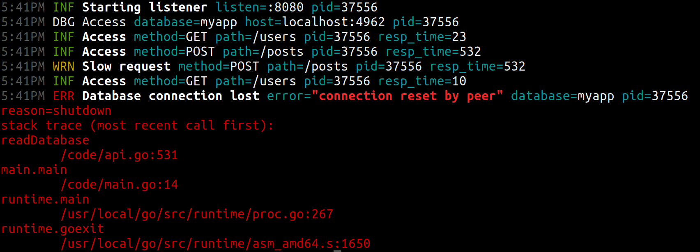

# Opinionated zerolog configuration

[](https://pkg.go.dev/gitlab.com/tozd/go/zerolog)
[](https://goreportcard.com/report/gitlab.com/tozd/go/zerolog)
[](https://gitlab.com/tozd/go/zerolog/-/pipelines)
[](https://gitlab.com/tozd/go/zerolog/-/graphs/main/charts)

A Go package providing opinionated [zerolog](https://github.com/rs/zerolog) configuration
and a pretty-printer tool for its logs, `prettylog`.

Features:

- Logging to both the console (with or without colors) and appending to a
  file at the same time. Each with its own logging level.
- JSON timestamps are in millisecond RFC format in UTC, e.g., `2006-01-02T15:04:05.000Z07:00`.
- JSON does not escape HTML. [#568](https://github.com/rs/zerolog/pull/568)
- Error's are converted to JSON using
  [gitlab.com/tozd/go/errors](https://gitlab.com/tozd/go/errors)'s `Formatter`
  into an object with error's message, a stack trace, optional details and
  recursively with joined and cause errors.
- Error's optional details and a stack trace are shown when logging to the console.
- Integrates well with [github.com/alecthomas/kong](https://github.com/alecthomas/kong)
  CLI argument parsing.
- Both Go's [global log](https://pkg.go.dev/log) and zerolog's global log
  are redirected to the configured zerolog logger.
- Supports adding logger to the [context](https://pkg.go.dev/context)
  which can buffer log entries (usually debug entries) until a log entry with
  a triggering level happens (usually an error), if ever.
- Provides a pretty-printer tool, `prettylog`, matching the configured
  zerolog's console output.



## Installation

This is a Go package. You can add it to your project using `go get`:

```sh
go get gitlab.com/tozd/go/zerolog
```

[Releases page](https://gitlab.com/tozd/go/zerolog/-/releases)
contains a list of stable versions of the `prettylog` tool.
Each includes:

- Statically compiled binaries.
- Docker images.

You should just download/use the latest one.

The tool is implemented in Go. You can also use `go install` to install the latest stable (released) version:

```sh
go install gitlab.com/tozd/go/zerolog/cmd/go/prettylog@latest
```

To install the latest development version (`main` branch):

```sh
go install gitlab.com/tozd/go/zerolog/cmd/go/prettylog@main
```

## Usage

### As a package

The package can be used with [github.com/alecthomas/kong](https://github.com/alecthomas/kong)
CLI argument parsing. In that case Kong populates the logging configuration
which you then pass to [`zerolog.New`](https://pkg.go.dev/gitlab.com/tozd/go/zerolog#New)
which then configures zerolog and sets `Logger` and `WithContext` fields:

```go
int main() {
  var config zerolog.LoggingConfig
  parser := kong.Must(&config,
    kong.UsageOnError(),
    kong.Writers(
      os.Stderr,
      os.Stderr,
    ),
    kong.Vars{
      "defaultLoggingConsoleType":             DefaultConsoleType,
      "defaultLoggingConsoleLevel":            DefaultConsoleLevel,
      "defaultLoggingFileLevel":               DefaultFileLevel,
      "defaultLoggingMainLevel":               DefaultMainLevel,
      "defaultLoggingContextLevel":            DefaultContextLevel,
      "defaultLoggingContextConditionalLevel": DefaultContextConditionalLevel,
      "defaultLoggingContextTriggerLevel":     DefaultContextTriggerLevel,
    },
    zerolog.KongLevelTypeMapper,
  )
  ctx, err := parser.Parse(os.Args[1:])
  parser.FatalIfErrorf(err)
  logFile, errE := zerolog.New(&config)
  defer logFile.Close()
  parser.FatalIfErrorf(errE)
  config.Logger.Info().Msgf("%s running", ctx.Model.Name)
}
```

Of course, you can construct the configuration struct yourself, too.
`zerolog.LoggingConfig` struct can also be nested or embedded inside another
struct if you need additional CLI arguments.

The main logger is available as `config.Logger`. You have to close returned
`logFile` once you stop using the logger (e.g., at the end of the program).

There is also `config.WithContext` which allows you to add a logger
to the [context](https://pkg.go.dev/context). Added logger buffers log
entries (usually debug entries) until a log entry with a triggering level
happens (usually an error), if ever.
This allows you to log at a lower level (e.g., debug) but output all those
log entries only if an error happens. Those logged debug entries can then
help debug the error.
If you want to disable this behavior, make trigger level be the same as
conditional level.

`zerolog.WithContext` returns a new context, and two functions, `close`
and `trigger`. You have to call `close` when you are done with the context
to free up resources. And you can call `trigger` if you want to force
writing out any buffered log entries (e.g., on panic).

See full package documentation with examples on [pkg.go.dev](https://pkg.go.dev/gitlab.com/tozd/go/zerolog#section-documentation).

### `prettylog` tool

zerolog can output logs as JSON. If your program happens to have such output, or if
you stored those logs somewhere and would like to format them in the same way
zerolog's console output looks like, you can use `prettylog` tool:

```sh
./program | prettylog
```

```sh
cat program.log | prettylog
```

If you have Go available, you can run it without installation:

```sh
cat program.log | go run gitlab.com/tozd/go/zerolog/cmd/go/prettylog@latest
```

Or with Docker:

```sh
cat program.log | docker run -i registry.gitlab.com/tozd/go/zerolog/branch/main:latest
```

The above command runs the latest development version (`main` branch).
See [releases page](https://gitlab.com/tozd/go/zerolog/-/releases) for a Docker image for the latest stable version.

## GitHub mirror

There is also a [read-only GitHub mirror available](https://github.com/tozd/go-zerolog),
if you need to fork the project there.
